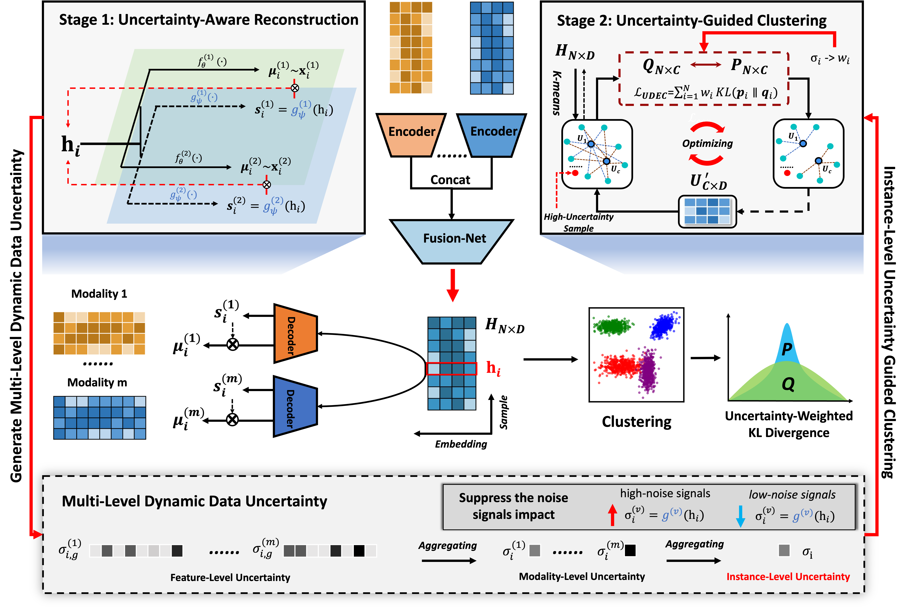
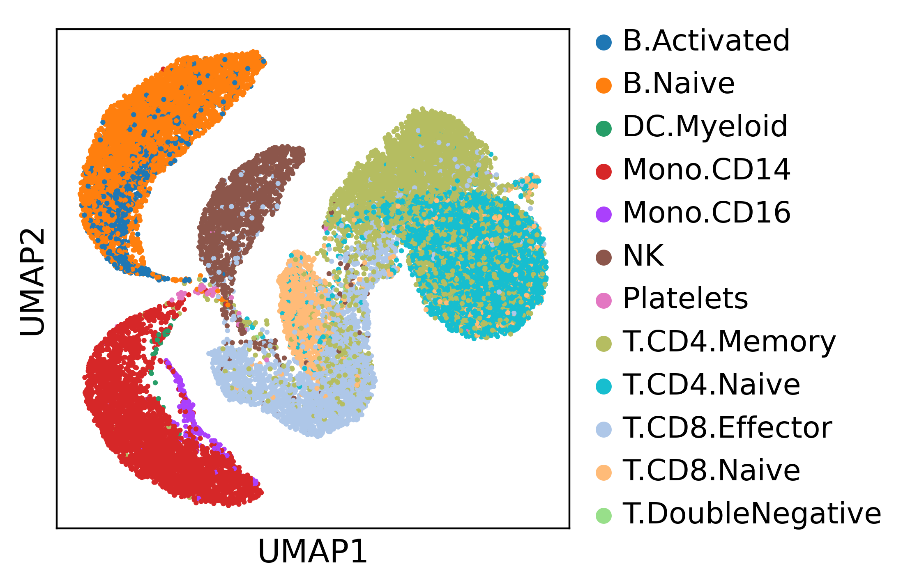
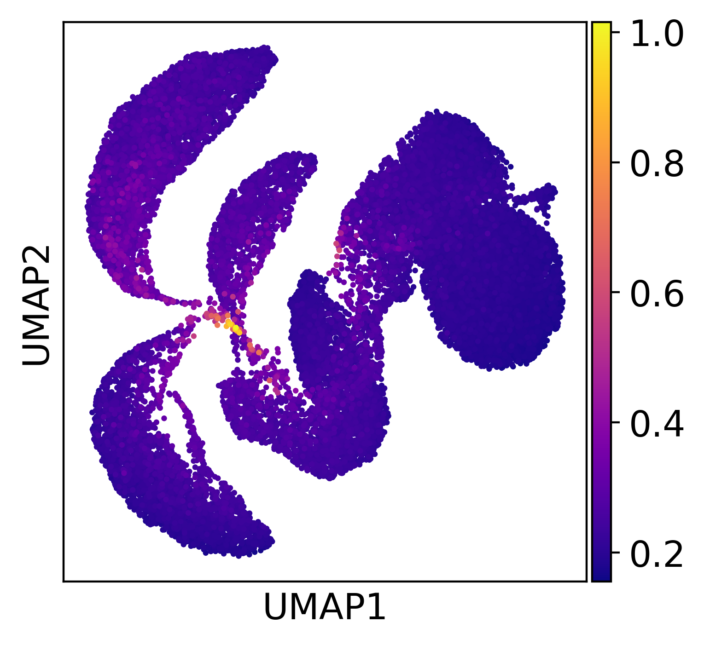
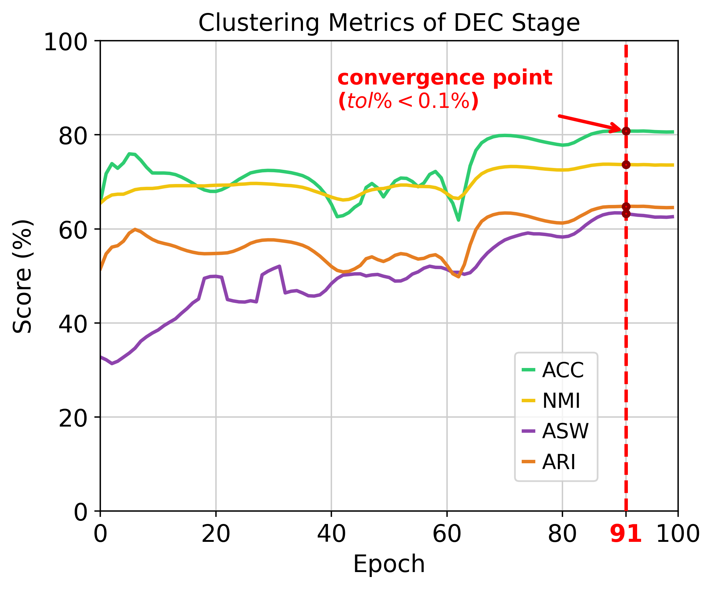

# UDEC-MO
UDEC-MO: an **U**ncertainty-guided **D**eep **E**mbedded **C**lustering framework for robust **M**ulti-**O**mics clustering. 

## Overview
Bulk and single-cell multi-omics technologies provide complementary molecular views for characterizing disease heterogeneity and cellular diversity. However, robust multi-omics clustering remains challenging due to high dimensionality, pervasive noise, modality heterogeneity, and substantial reliability variation across features, modalities, and samples or cells. Existing clustering methods often insufficiently account for such multi-level data quality variation. Here, we present **UDEC-MO**, an **U**ncertainty-guided **D**eep **E**mbedded **C**lustering framework for robust **M**ulti-**O**mics clustering. UDEC-MO first estimates feature-wise heteroscedastic uncertainty through uncertainty-aware reconstruction and summarizes it into modality-level and instance-level uncertainty scores. The instance-level uncertainty is further transformed into reliability weights to modulate the KL-divergence loss in deep embedded clustering, allowing reliable samples or cells to guide cluster refinement while reducing the influence of highly uncertain instances. We evaluated UDEC-MO on both bulk cancer multi-omics datasets and single-cell multi-omics datasets generated by different sequencing technologies. The results demonstrate that UDEC-MO achieves competitive or superior clustering performance across multiple metrics and provides meaningful uncertainty estimates for identifying unreliable features, less reliable modalities, and ambiguous instances. 



## 📦 Requirements
- scikit-learn  
- pytorch
- scanpy
- numpy
- pandas
- matplotlib
- scipy

## 🚀 Usage
To reproduce the results, simply run the following command:

```bash
python main.py # For TEA-seq Dataset
```

## 📊 Expected Results

After running the "main.py" script, a expected metric table of clustering performance will be shown like:

| Metric | Clustering ACC | NMI | ASW | ARI |
|--------|--------|--------|--------|--------|
| Score | 0.8079 | 0.7368 | 0.6324 | 0.6478 |

### Instance-level uncertainty Visualization
We can plot the UMAP of the cells by their labels and instance-level uncertainties, reference to the notebook [visual_sample_uncertainty.ipynb](./visual_sample_uncertainty.ipynb). We can observe that cells at the cell type boundaries exhibit higher uncertainty, indicating that the DUR of UDEC-MO can capture both the cell structure and the dynamical uncertainty at the cell level. Additionally, this provides additional interpretability, aiding in the understanding and identification of ambiguous or noisy cells.

<div align="center">
  
  
</div>

### Convergence Plot of the UDEC Stage
We can plot the convergence of the stage 2, according to the output of the **main.py** script.
<div align="center">
  
</div>


## ⚠️ Disclaimer
This code is intended for **academic research only** and is **not approved for clinical use**. If you have any questions, please contact me via the following email [ljwstruggle@gmail.com](ljwstruggle@gmail.com).

## 📜 License
All rights reserved. Redistribution or commercial use is prohibited without prior written permission.
